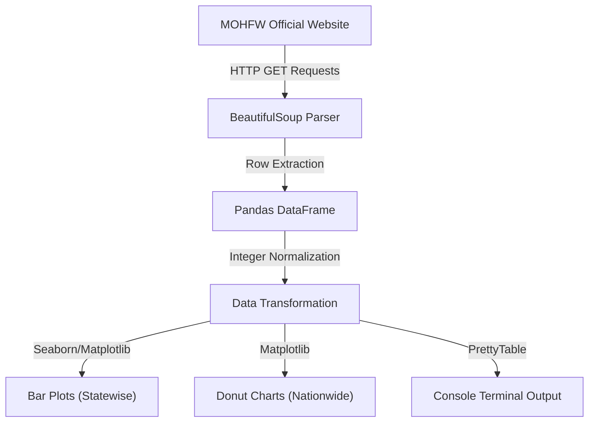

# Technical Specification: COVID-19 Web Scraper

## Architectural Overview

The **COVID-19 Web Scraper** is a Python-based asynchronous data extraction utility designed for high-fidelity monitoring of public health statistics. It utilizes a layered architecture to transition from raw HTML scraping to structured statistical visualization.

### Data Lifecycle Diagram

---

## Technical Implementations

### 1. Web Scraping Engine: BeautifulSoup4
The utility employs `BeautifulSoup` with the `html.parser` engine to navigate the Document Object Model (DOM) of the Ministry of Health and Family Welfare website.
- **Normalization**: A lambda function `extract_contents` is implemented to sanitize table data by removing escape characters (e.g., `\n`) and trailing whitespace.
- **Filter Logic**: The parser specifically targets `<tr>` and `<td>` elements, validating a 5-column schema (Sr.No, States, Confirmed, Recovered, Deceased) to maintain data integrity.

### 2. Data Processing: Pandas
Processed rows are instantiated into a `Pandas DataFrame` for robust statistical operations.
- **Type Casting**: Raw string values from the web are cast to `int64` using the `.map(int)` method, enabling mathematical summation and plotting operations.
- **National Totals**: The utility dynamically calculates nationwide sums for all categories to provide an aggregated overview.

### 3. Visualization Pipeline
The project utilizes two distinct visualization paradigms to represent different data dimensions:
- **Comparative Analysis (Seaborn)**: Horizontal bar plots (`plt.barh`) are used for state-wise comparisons, with `sns.set_style("ticks")` for a clean, scholarly aesthetic.
- **Proportional Analysis (Matplotlib)**: A refined donut chart (constructed by overlaying a white `plt.Circle` on a pie chart) visualizes the ratio of Confirmed vs. Recovered vs. Deceased cases.

### 4. Terminal Interface
To ensure usability without graphical overhead, the `PrettyTable` library is used to render a formatted, ASCII-based representation of the live statistics in the console.

---

## Technical Prerequisites

- **Language**: Python 3.7+
- **Core Dependencies**: `requests`, `bs4`, `pandas`, `matplotlib`, `seaborn`, `prettytable`.
- **Connectivity**: High-speed internet access for real-time scraping.

---

*Technical Specification | Computer Engineering Project | Version 1.0*
